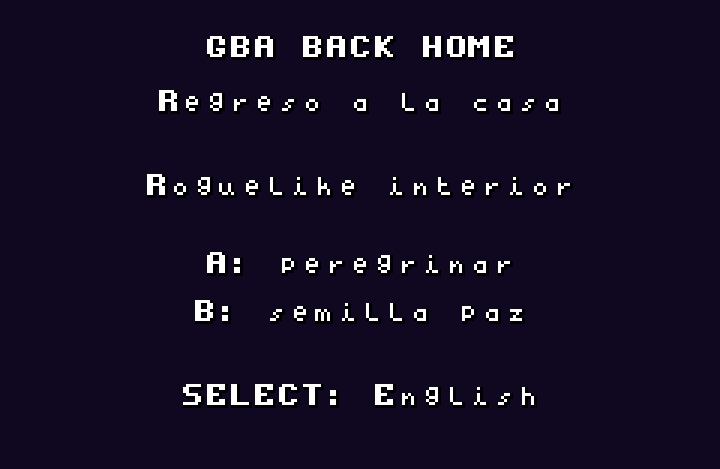
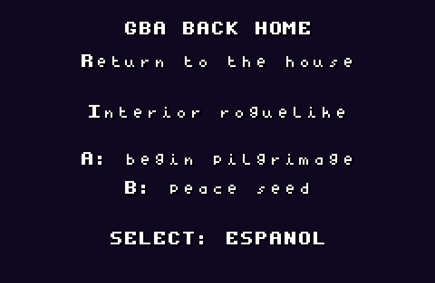
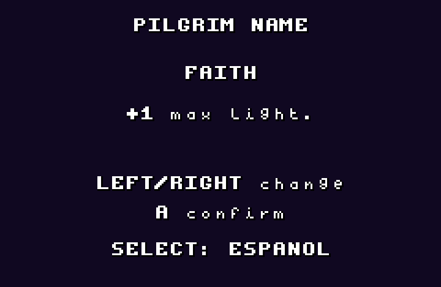
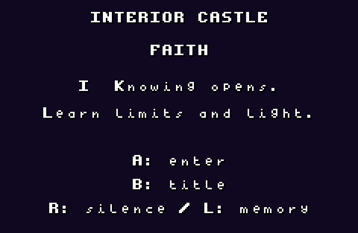
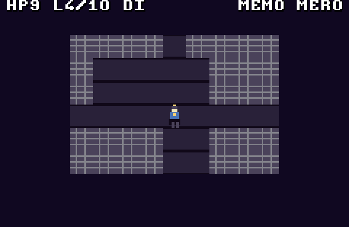

# gba-back-home

**gba-back-home** is a procedural dungeon crawler for **Game Boy Advance**, built with **Butano**. Its central fantasy is not conquering a dungeon, but returning to the Father's house through seven inner dwellings: advancing, keeping silence, remembering, discerning doors, and learning when combat is not enough.

This expanded vertical slice includes Docker, the compiler toolchain, an emulator path, placeholder sprites and audio, procedural generation, dwelling rules, combat, prayer, silence, memories, false doors, shrines with a cost, enemy roles, a final boss, and bilingual in-game text in Spanish and English.

## Contents

- Complete Butano project: `Makefile`, modular `src/` code, `graphics/`, `audio/`, `dmg_audio/`.
- Docker image with devkitPro/devkitARM, Butano, mGBA, and password-protected noVNC.
- VS Code/Codex devcontainer.
- 4bpp BMP sprites plus JSON metadata for Butano.
- Placeholder MOD music and WAV sound effects.
- Pilgrim selection: **Faith**, **Hope**, **Charity**, **Peace**.
- Procedural room/corridor generator with BFS validation for key and exit placement.
- Safe starting area, resources, shrine, false doors, and silence thresholds.
- Seven dwellings with distinct playable rules.
- Prayer as damage, pacification, and discernment.
- Silence/wait action.
- Relics reframed as memories.
- Final boss: **The False Door**.
- Host-side seed validation tool: `tools/procedural_smoke_test.py`.

## Docker Startup

```bash
docker compose build
docker compose up -d gba-dev
docker compose exec gba-dev scripts/doctor.sh
docker compose exec gba-dev scripts/build.sh
docker compose exec gba-dev scripts/run-rom.sh
```

Open the emulator in the browser:

```text
http://localhost:6080/vnc.html
```

Default password: `gba`.

## Local Startup Without Docker

Install devkitARM/devkitPro, Python, Butano, and a compatible GBA emulator such as mGBA. Then run:

```bash
scripts/fetch-butano.sh
scripts/doctor.sh
scripts/build.sh
scripts/run-rom.sh
```

You can also point the build to an external Butano installation:

```bash
LIBBUTANO=/opt/butano/butano make -j$(nproc)
```

## Language

The game contains Spanish and English text. Press `SELECT` on the title, pilgrim selection, dwelling lore, victory, or defeat screens to switch language.

Documentation is intentionally kept in English.

## Screenshots

The following screenshots were captured from the built ROM running in mGBA through the included noVNC environment.

For the repeatable capture workflow, emulator launch flags, key automation, cropping, and troubleshooting, see [Emulator Screenshots And Visual Checks](docs/EMULATOR_SCREENSHOTS.md).

### Bilingual Title Screen



The default Spanish title screen introduces the interior roguelike theme, exposes the main start action, and shows `SELECT: English` as the runtime language toggle.



After pressing `SELECT`, the same screen is redrawn in English. This verifies that the title flow is not a separate mock screen: the game swaps localized strings while staying in the same menu state.

### Pilgrim Selection



The pilgrim selection screen shows the active archetype, its mechanical rule, and the localized controls. `LEFT` and `RIGHT` cycle between Faith, Hope, Charity, and Peace before confirming the run.

### Dwelling Introduction



Before entering each dwelling, the game presents the selected pilgrim, the current interior dwelling, the rule for that stage, and the reminder that `R` is silence while `L` recalls memory.

### Dungeon Exploration



The dungeon view uses a compact GBA HUD: HP appears on the left, light and maximum light sit beside it, the current dwelling is shown as a Roman numeral, and memory/mercy counters are shown on the right. The center viewport follows the pilgrim through the procedural room layout.

## Controls

| Button | Action |
|---|---|
| D-Pad | Move / face the pilgrim |
| A | Basic resolve strike in the last faced direction |
| B | Prayer: consumes light, damages or pacifies enemies, and discerns nearby doors |
| R | Silence: wait, listen, recover light, or open silence thresholds |
| L | Show the last memory or a signal |
| SELECT | Short controls help in the dungeon; language switch on menu/result screens |
| START | Pause; in `GBH_DEBUG`, `L+R+START` regenerates the dwelling |

## Pilgrims

- **Faith**: +1 maximum light and longer prayer range.
- **Hope**: once per run, a fall raises you back with 1 HP.
- **Charity**: prayer pacifies non-beast enemies instead of destroying them.
- **Peace**: enemies have less detection range and you start with more light.

## Play Loop

1. Choose a pilgrim.
2. Enter a dwelling.
3. Find the inner key.
4. Learn to use bread, candles, shrines, silence, and prayer.
5. Distinguish true, false, and silence doors.
6. Collect optional memories.
7. Cross the threshold.
8. In the seventh dwelling, face **The False Door**.

## Dwellings

1. **Self-Knowledge**: learning, limits, simple enemies.
2. **Calling**: `R` points toward the key or exit.
3. **Discipline**: scarcer resources and more shadows.
4. **Stillness**: safe waiting recovers light.
5. **Trust**: more false doors and haste enemies.
6. **Purification**: beast guardians and higher punishment for careless play.
7. **Home**: the threshold leads to the discernment boss.

## Generation Tests

The smoke test mirrors the procedural model on the host and validates key/exit connectivity across many seeds:

```bash
python3 tools/procedural_smoke_test.py --seeds 1000
```

It does not replace the Butano build, but it helps catch procedural design regressions.

## Release

The first playable ROM was published as GitHub release `v0.1.0`:

```text
https://github.com/arfipod/gba-back-home/releases/tag/v0.1.0
```

The release was created with GitHub CLI after browser authentication:

```bash
gh auth login
gh release create v0.1.0 gba-back-home.gba \
  --repo arfipod/gba-back-home \
  --target main \
  --title "gba-back-home v0.1.0" \
  --notes "First playable GBA ROM release."
```

## Recommended Next Work

1. Playtest 30-50 seeds per dwelling.
2. Move visible map rendering from sprites to a background/tilemap to free OAM.
3. Continue extracting smaller systems from `gbh_dungeon_actions.cpp` as combat and AI grow.
4. Add SRAM for persistent relic/memory records and options.
5. Create final art and frame-based animations.
